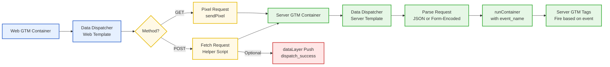

# Data Dispatcher for Google Tag Manager

A lightweight, privacy-aware event dispatcher for seamless data exchange between Web GTM and Server GTM — with flexible parameter mapping, optional debug handling, and optional server confirmation logic.

→ **Bridge Web and Server GTM with full control and transparency.**

## Overview

**Data Dispatcher** provides a clean, consent-controlled way to send custom tracking events from your Web GTM container to your Server GTM container. It replaces complex server-side tracking setups with a lightweight, GTM-managed solution that supports both GET (pixel) and POST (fetch) dispatch methods, automatic metadata inclusion, and optional dataLayer feedback.

The architecture separates client-side dispatch and server-side reception: a Web GTM template handles event construction and transmission, while a matching Server GTM template receives, parses, and processes incoming requests. This ensures that data flows transparently through your GTM infrastructure without requiring third-party dependencies or cookies.

### The Problem

Traditional approaches to sending data from Web GTM to Server GTM require custom server endpoints, request parsing logic, and event routing outside of GTM. This creates maintenance overhead, reduces marketing agility, and makes debugging difficult.

> **Manual approach** = Custom server endpoints + request parsing + event routing <br>→ Requires backend development and ongoing maintenance

**Data Dispatcher** solves this with a GTM-native template solution that is fully configurable in the GTM UI, provides unified debug visibility, and enables optional feedback loops — all without backend code.

### Benefits

| Feature | Benefit |
|:--------|:--------|
| **GTM-native** | No backend code required, fully configurable in GTM UI |
| **Dual methods** | Choose GET (pixel) or POST (fetch) based on payload size |
| **Auto metadata** | Page URL, referrer, timestamp, random ID included with checkboxes |
| **Debug mode** | Unified logging across Web and Server GTM |
| **Feedback loop** | Optional dataLayer events confirm successful server-side processing |
| **Privacy-friendly** | No cookies required, fully client-side until explicit dispatch |
| **CORS-safe** | Proper header handling for cross-origin requests |
| **Lightweight** | Minimal overhead, no third-party dependencies |

## Technical Considerations

**Why not just use GA4 Measurement Protocol or direct API calls?**

- **GTM integration** → Direct API calls bypass GTM's consent and event processing logic. Data Dispatcher runs within GTM, respecting consent controls and enabling event-based triggers.
- **Flexibility** → Measurement Protocol is GA4-specific. Data Dispatcher works with any server-side analytics or processing logic you configure in Server GTM.
- **Visibility** → API calls are opaque within GTM. Data Dispatcher provides debug logging and optional dataLayer feedback for full transparency.
- **Event routing** → Direct API calls require hard-coded endpoints. Data Dispatcher uses Server GTM's event system, enabling flexible tag firing based on event names and parameters.
- **Maintenance** → API integrations require code changes for new events or parameters. Data Dispatcher is template-based and configurable via GTM UI.

**Why GET and POST methods?**

- **GET (pixel)** → Simple, reliable, no CORS preflight. Ideal for small payloads and scenarios where request visibility in server logs is acceptable. No external script required.
- **POST (fetch)** → Supports larger payloads, nested JSON structures, and avoids URL length limitations. Requires helper script for CORS-safe execution, but provides optional dataLayer feedback on success.

**GET vs. POST for Marketing Events**

| Theme              | ❌ GET (Limitations)                                                                    | ✅ POST (Advantages)                                                              |
|:-------------------|:----------------------------------------------------------------------------------------|:----------------------------------------------------------------------------------|
| **Payload size**   | Limited by URL length (~2000 chars practical limit)                                    | No practical limit, supports large payloads                                      |
| **Data structure** | Flat key-value pairs only                                                              | Supports nested JSON objects and arrays                                          |
| **CORS**           | No preflight, but visible in server logs and browser history                           | CORS preflight possible, more control over request headers                        |
| **Feedback**       | No response parsing (pixel returns 1x1 GIF)                                            | JSON response parsing enables dataLayer feedback                                 |
| **Privacy**        | Parameters visible in URL, server logs, and referrer headers                           | Body content not exposed in URL or referrer headers                              |
| **Dependencies**   | None (uses GTM's built-in `sendPixel`)                                                 | Requires external helper script hosted on your domain                            |

## Architecture & Data Flow



### **Processing Flow**
1. **Web GTM**  
  Tag fires → Build payload (custom params + auto metadata + optional debug flag) → Dispatch via GET or POST
2. **Server GTM**  
  Client receives request → Parse JSON/form-encoded → Extract `event_name` → `runContainer(eventData)` → Server tags fire
3. **Optional**  
  POST method can push `{event_name}_success` or `{event_name}_error` to dataLayer

## Components

| File                                     | Description                                                                                                                                    |
|:-----------------------------------------|:-----------------------------------------------------------------------------------------------------------------------------------------------|
| **`templates/data-dispatcher-web.tpl`**  | GTM Custom Template for Web container. Handles event construction, parameter mapping, and dispatch via GET or POST. Import into Web GTM.   |
| **`templates/data-dispatcher-server.tpl`** | GTM Custom Client for Server container. Receives requests, parses payloads, and routes events to container. Import into Server GTM.         |
| **`code/data-dispatcher-web.js`**        | Core logic for Web dispatcher (embedded in Web template). Handles payload building, method selection, and dispatch execution.                 |
| **`code/data-dispatcher-server.js`**     | Core logic for Server receiver (embedded in Server template). Handles request parsing, CORS headers, and container execution.                 |
| **`helper/dispatch-helper.js`**          | Optional fetch helper script for POST requests. Provides `postDispatch()` function with CORS-safe fetch and optional dataLayer feedback.     |
| **`helper/dispatch-helper.min.js`**      | Minified version of the helper script for production use.                                                                                     |

## Installation Guide

### Prerequisites

- Web GTM container with template import permissions
- Server GTM container with custom client creation permissions
- (For POST requests) Ability to host helper script on your own domain

### Step 1: Import Web GTM Template

1. Open your **Web GTM container** in Google Tag Manager.
2. Navigate to **Templates** → **Tag Templates** → **New**.
3. Click **⋮ (three dots)** → **Import**.
4. Select `templates/data-dispatcher-web.tpl`.
5. Review and **Save** the template.

→ The template will appear in your tag template gallery as **"Data Dispatcher (Web)"**.

### Step 2: Import Server GTM Template

1. Open your **Server GTM container** in Google Tag Manager.
2. Navigate to **Templates** → **Clients** → **New**.
3. Click **⋮ (three dots)** → **Import**.
4. Select `templates/data-dispatcher-server.tpl`.
5. Review and **Save** the client.

→ The client will appear in your client gallery as **"Data Dispatcher (Server)"**.

### Step 3: Configure Server GTM Client

1. In Server GTM, go to **Clients** and open **"Data Dispatcher (Server)"**.
2. Configure the following fields:

| Field            | Default      | Description                                                                                    |
|:-----------------|:-------------|:-----------------------------------------------------------------------------------------------|
| **Request Path** | `/dispatch`  | The endpoint path that will receive requests. Must match the path in your Web GTM tag.        |
| **Debug Logging** | `false`      | Enable to log incoming requests to Server GTM console (useful for troubleshooting).            |
| **Allowed Origin** | `auto`       | CORS origin header. Use `auto` to reflect the incoming request's origin dynamically.           |
| **Allowed Methods** | `POST, OPTIONS` | HTTP methods allowed in CORS preflight responses.                                              |
| **Allowed Headers** | `Content-Type` | Headers allowed in CORS preflight responses.                                                  |

3. **Save** the client.

→ The client will now listen for requests at the specified path.

### Step 4: Host Helper Script (POST Requests Only)

If you plan to use **POST method**, you need to host the helper script on your own domain:

1. Copy `helper/dispatch-helper.js` or `helper/dispatch-helper.min.js` to your web server.
2. Ensure the file is accessible via HTTPS (required for secure contexts).
3. Note the full URL (e.g., `https://www.your-domain.com/gtm/dispatch-helper.js`).

→ The helper script provides the `postDispatch()` function that handles CORS-safe fetch calls.

**Why host on your own domain?**

- **Cookie preservation**: Same-origin requests include cookies automatically, maintaining session continuity.
- **CSP compliance**: Content Security Policy may restrict script injection from external domains.
- **Performance**: First-party scripts load faster and are more reliable.

### Step 5: Create Web GTM Tag

1. In **Web GTM**, go to **Tags** → **New**.
2. Select **"Data Dispatcher (Web)"** as the tag type.
3. Configure the tag fields:

#### Basic Configuration

| Field                | Description                                                                                    | Example                          |
|:---------------------|:-----------------------------------------------------------------------------------------------|:---------------------------------|
| **Tracking Domain**  | Base URL of your Server GTM container (required)                                               | `https://sgtm.your-domain.tld`   |
| **Endpoint Name**    | Path that matches your Server GTM client's Request Path                                       | `/dispatch`                      |
| **Event Name**       | Name of the event as it will appear in Server GTM                                             | `form_submission`                 |

#### Method Selection

**GET Method** (Recommended for simple events):
- No additional configuration required
- No external script needed
- Suitable for small payloads (< 2000 characters)

**POST Method** (Recommended for complex events):
- **Fetch Script URL**: Full URL to your hosted helper script (required)
- **Send Nested Objects (JSON)**: Enable if payload contains objects/arrays
- **Add Event Name as GET Parameter**: Optional, for easier debugging
- **Push "dispatch_success" to Data Layer**: Enable to receive feedback events

#### Event Data Configuration

**Custom Parameters**:
- Add key-value pairs for any custom data you want to send
- Keys and values can use GTM variables (e.g., `{{Form ID}}`, `{{User ID}}`)

**Document Context** (Optional checkboxes):
- ✅ **Include Page URL** → Adds `page_location` parameter
- ✅ **Include Page Host** → Adds `page_host` parameter
- ✅ **Include Page Path** → Adds `page_path` parameter
- ✅ **Include Page Referrer** → Adds `page_referrer` parameter

**Event Context** (Optional checkboxes):
- ✅ **Include Event Timestamp** → Adds `event_timestamp` (milliseconds)
- ✅ **Include Random Event ID** → Adds `event_random_id` (10-digit random number)

#### Debugging Configuration

- **Log to GTM Debug Console**: Enable to see payloads and URLs in GTM Preview mode
- **Enable if URL contains (keywords)**: Comma-separated keywords (e.g., `debug,test,preview`) that trigger `dispatch_debug=true` flag
- **Enable if this field equals "true"**: GTM variable or literal that triggers `dispatch_debug=true` flag

4. **Trigger**: Select when this tag should fire (e.g., `form_submit`, `custom_event`, `All Pages`).
5. **Save** the tag.

### Step 6: Configure Server GTM Tags

In your **Server GTM container**, create tags that respond to dispatched events:

1. Create a new tag (e.g., **GA4 Event Tag**).
2. **Trigger**: Create a custom trigger with:
   - **Event name**: Matches your Web GTM tag's event name (e.g., `form_submission`)
   - **This trigger fires on**: `Some Custom Events`
3. **Event Parameters**: Map Data Layer Variables to GA4 parameters:
   - Use `{{event_name}}` for the event name
   - Use `{{custom_parameter_key}}` for any custom parameters sent from Web GTM
4. **Save** the tag.

→ Server GTM tags will now fire when matching events are received from Web GTM.

### Step 7: Test the Setup

1. **Enable GTM Preview Mode** in Web GTM.
2. **Enable Server GTM Preview** in Server GTM.
3. Trigger the event that fires your Data Dispatcher tag.
4. **Verify in Web GTM Preview**:
   - Tag fires successfully
   - Debug console shows dispatch URL/payload (if enabled)
   - Network tab shows request to Server GTM endpoint
5. **Verify in Server GTM Preview**:
   - Client receives request
   - Debug console shows parsed event data (if enabled)
   - Server tags fire with correct parameters
6. **Verify dataLayer feedback** (POST method only, if enabled):
   - Check for `{event_name}_success` or `{event_name}_error` events
   - Verify `dispatch_status` and `dispatch_echo` parameters

## Usage Examples

### Example 1: Simple Form Submission (GET)

**Configuration**:
- Method: GET
- Event Name: `form_submission`
- Custom Parameters: `form_id`, `form_name`
- Document Context: ✅ Page URL, ✅ Page Referrer
- Event Context: ✅ Event Timestamp

**Result**: `https://sgtm.example.com/dispatch?event_name=form_submission&form_id=contact&...`

### Example 2: E-commerce Purchase (POST with JSON)

**Configuration**:
- Method: POST
- Event Name: `purchase`
- Send Nested Objects (JSON): ✅ Enabled
- Push to Data Layer: ✅ Enabled
- Custom Parameters: `transaction_id`, `value`, `currency`, `items` (nested array)

**Result**: POST with JSON body containing nested `items` array. `purchase_success` event pushed to dataLayer on success.

### Example 3: Debug Mode via URL Keyword

**Configuration**:
- Debug Keywords: `debug,test,staging`

**Result**: When URL contains any keyword, `dispatch_debug=true` is automatically added to payload.

### Example 4: Consent-Controlled Dispatch

**Configuration**:
- Standard setup
- **Trigger**: Custom trigger with `{{Consent - Marketing}} equals true`
- **OR Exception**: `{{Consent - Marketing}} equals false`

**Result**: Tag only fires when marketing consent is granted (GDPR/ePrivacy compliant).

## Advanced Configuration

### Custom Parameter Mapping with GTM Variables

You can use any GTM variable in custom parameters:

```javascript
// Examples:
Key: "user_id"          → Value: {{User ID}}
Key: "page_category"    → Value: {{Page Category}}
Key: "campaign_source" → Value: {{Campaign Source}}
Key: "custom_dim_1"    → Value: {{Custom Dimension 1}}
```

### Nested JSON Structures (POST Only)

When using POST with JSON enabled, you can send complex nested structures:

```json
{
  "event_name": "product_view",
  "product": {
    "id": "12345",
    "name": "Example Product",
    "category": "Electronics",
    "price": 99.99
  },
  "user": {
    "segment": "premium",
    "lifetime_value": 500
  }
}
```

**Note**: Nested structures require POST method with "Send Nested Objects (JSON)" enabled.

### DataLayer Feedback Events (POST Only)

When "Push to Data Layer" is enabled, the helper script pushes events on success or failure:

**Success Event**:
```javascript
{
  event: "form_submission_success",
  dispatch_event_name: "form_submission",
  dispatch_status: "ok",
  dispatch_echo: { /* server response echo */ }
}
```

**Error Event**:
```javascript
{
  event: "form_submission_error",
  dispatch_event_name: "form_submission",
  dispatch_status: "error",
  error_message: "http_500" // or error details
}
```

You can create triggers in Web GTM based on these events to fire downstream tags.

### CORS Configuration

For cross-origin requests, configure CORS in the Server GTM client:

- **Allowed Origin**: Set to `auto` to reflect the request origin, or specify a fixed origin
- **Allowed Methods**: Include `POST, OPTIONS` for POST requests
- **Allowed Headers**: Include `Content-Type` and any custom headers you send

**Note**: GET requests (pixels) don't require CORS configuration, but POST requests do.


## Troubleshooting

| Issue | Solution |
|:------|:---------|
| **Tag not firing** | Check trigger conditions, consent variables, GTM Preview mode, enable debug logging |
| **Request not reaching Server GTM** | Verify Tracking Domain and Endpoint Name match Server GTM client path, check network tab, verify CORS headers (POST) |
| **Server GTM not processing** | Verify client is active, path matches exactly, enable debug logging, check `event_name` parameter |
| **POST requests failing** | Verify helper script URL is accessible, check CORS configuration, validate JSON payload, inspect browser console |
| **Parameters missing** | Verify parameter keys match Server GTM expectations, check Data Layer Variable names, enable debug to see received payload |

## Browser Compatibility

| Browser | Version | Status | Notes |
|:--------|:--------|:-------|:------|
| Chrome  | 60+     | ✅ Full | Full fetch API support |
| Firefox | 55+     | ✅ Full | Full fetch API support |
| Safari  | 11+     | ✅ Full | Full fetch API support |
| Edge    | 79+     | ✅ Full | Full fetch API support |
| IE11    | 11      | ⚠️ Limited | GET works, POST requires polyfill |
| IE9-10  | 9-10    | ⚠️ Limited | GET works, POST not supported |

**Graceful Degradation**: 
- GET method (pixel) works in all browsers, including IE9+
- POST method requires modern browser with fetch API support (or polyfill for IE11)
- Helper script includes error handling for maximum compatibility

## Privacy & Security

### Data Handling

- **No cookies required**: Data Dispatcher does not set or read cookies
- **Client-side only**: Data remains in browser until explicit dispatch
- **Consent-controlled**: Can be gated by GTM consent triggers and exceptions
- **First-party only**: Helper script should be hosted on your own domain

### Security Considerations

- **HTTPS required**: Helper script and Server GTM endpoint should use HTTPS
- **CORS configuration**: Properly configure allowed origins to prevent unauthorized access
- **Parameter validation**: Server GTM should validate and sanitize incoming parameters
- **Rate limiting**: Consider implementing rate limiting in Server GTM or upstream infrastructure

### GDPR & Privacy Compliance

- **Consent gates**: Use GTM consent triggers to control when tags fire
- **Data minimization**: Only include necessary parameters in events
- **Transparency**: Document data flow in privacy policy
- **User rights**: Ensure data can be deleted or modified per user requests

## License

MIT – see [LICENSE](./LICENSE)

## Author

/ MEDIAFAKTUR – Marketing Performance Precision, [https://mediafaktur.marketing](https://mediafaktur.marketing)  
Florian Pankarter, [fp@mediafaktur.marketing](mailto:fp@mediafaktur.marketing)